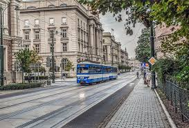

## TEAM
1. a. Artem Yevtushenko  
    b. em3rch  
    c. 1,6

2. a. Mateusz Wójcik  
    b. mwojc2137
    c. 4,5

3. a. Oliwier Strzelecki  
    b. olixToKozak  
    c. 2,3

## Introduction
Public transport in Kraków plays a vital role in connecting residents, students, and tourists across the city. The system is well-developed, with a combination of trams, buses, and regional connections reaching nearly every neighborhood. Thanks to its extensive coverage and regular timetables, the network provides an efficient alternative to car use and helps reduce traffic congestion.

Over the years, Kraków’s public transport has become known for its reliability, affordability, and integration with modern technology. Most vehicles are equipped with digital displays, ticket machines, and air conditioning, ensuring passenger comfort. Mobile apps such as JakDojade and MPK Kraków allow users to plan routes easily and track real-time arrival information.

Sustainability is another major focus of the city’s transport strategy. Kraków is gradually replacing older diesel vehicles with electric and hybrid models to reduce pollution. Investment in tram infrastructure, cycling paths, and park-and-ride zones reflects the city’s commitment to creating an environmentally friendly, accessible, and modern transportation system for all residents and visitors.

## Data
|Line Number|Transport Type|Main Route|Frequency (minutes)|
|-|-|-|-|
|4|Tram|Bronowice Małe – Wzgórza Krzesławickie|7|
|105|Bus|Nowy Bieżanów Południe – Dworzec Główny Zachód|10|
|152|Bus|Os. Podwawelskie – Kraków Airport (Balice)|20|
|50|Tram|Kurdwanów – Krowodrza Górka|5|

The table illustrates the diversity in both transport modes and service frequency. Trams generally run more frequently on main city routes, while buses cover longer or less central connections.

## Images

